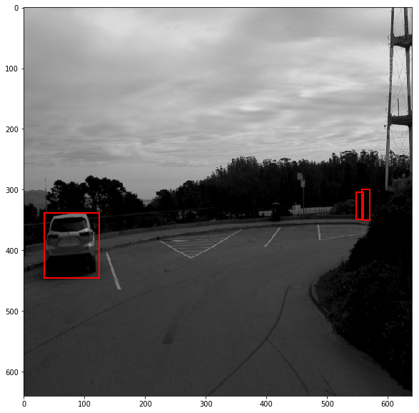

## Project overview

In this project  first, we performed an extensive data analysis including the computation of label distributions, displayed some sample images, and checked for object occlusions.
To deploy our model to get predictions on images sent to the API we used the TensorFlow Object Detection API.
I monitored the training with TensorBoard and decide when to end it. To improve my model's performance finally, I experimented it with different hyperparameters to improve my model's performance. I also provided with code to create a short video of the model predictions.
Project files were given in  Github repository where starter code is also given.

## Docker Setup
For local setup I have used the provided Dockerfile and requirements in the build directory of the starter code. Built the image created a container. After creating container installed gsutil and added to my path to use it later befor downloading dataset as to do auth login.

## Dataset

For this project, we used data from the Waymo Open dataset. Downloaded the files directly from the website as tar files or from the Google Cloud Bucket as individual tf records. 
To download dataset files in download_process.py  file we wrote code in  create_tf_example function. This function takes the components of a Waymo Tf record and save them in the Tf Object Detection api format.
Then ran the script at using
`python download_process.py --data_dir /home/workspace/data/ --temp_dir /home/backups/`
Now, all downloaded files are stored in `/home/workspace/data/processed` directory.
After downloading and processing the data we explored the data.

## Dataset Analysis

Opened Exploratory Data Analysis in notebook. In this notebook,implemented the display_instances function using matplotlib to display images and annotations.
After displaying random images from several tf record files, we can observe the images :

1) All the images are recorded in urban environment.   
2) Object classes include vehicle,pedestrian, and cyclist. 

## Training

First we need to split the split the data to create the different splits: training, validation and testing for that implemented the split_data function in the create_splits.py file.
In `create_splits.py` script, dataset are split into train, and eval, and test, whose ratios are set as 0.8, 0.1, 0.1 respectively.
From the entire dataset I took 80% for training , 10% for validation and rest 10% for testing.

* Reason of shuffle the whole dataset   
Shuffling data serves the purpose of reducing variance and making sure that models remain general and overfit less.The intent behind this step is to make sure that the three splits we obtain later on have similar scenarios, for example, they all have urban and highway scenario. The validation performance of the trained model is expected to be poor if the training and validation scenarios are very different.  

* Split the dataset into train, val and test    
The train split is the largest corpus of my dataset it is used for train my model. After training, inference on these images will be taken with a grain of salt, since the model has already had a chance to look at and memorize the correct output.
The val split is a separate section of my dataset that I used during training to get a sense of how well my model is doing on images that are not being used in training.
Because the validation set is heavily used in model creation, it is important to hold back a completely separate stronghold of data - the test split. I ran evaluation metrics on the test set at the very end of my project. The Test dataset provides the gold standard used to evaluate the model.

* Split ratios.   
Dataset spliting ratio depends on the two things.One is the total number of samples and another is the actual model of itraining. Insufficent training data may cause overfitig as well as insufficent eval/test data  may not be able to get an accurate estimate of the model's accuracy due to lack of test samples. For that striking a right balance with respect to  ratio split is so important. The ratios used in splitting dataset is mainly based on past experience. I adopted a commonly occurring ratio in machine learning community, the ratio we used for train/val/test is 0.8, 0.1, 0.1. 

By running this following script  `python create_splits.py --data_dir /home/workspace/data/`

train, test and val directory will be created and all files will be moved to train, test and val directory from processed directory.
We used pipeline.config for this project , it is the config for a SSD Resnet 50 640x640 model.
Created a directory named training and kept the pretained model in  `training/pretrained-models/`.

To change the location of the training and validation files, as well as the location of the label_map file, pretrained weights we edited the config files.We also adjusted the batch size which is 8.

To create  `pipeline_new.config` ran the following script 

`python edit_config.py --train_dir /home/workspace/data/train/ --eval_dir /home/workspace/data/val/ --batch_size 8 --checkpoint ./training/pretrained-models/ssd_resnet50_v1_fpn_640x640_coco17_tpu-8/checkpoint/ckpt-0 --label_map label_map.pbtxt`

Created another directory under training named reference where kept the pipeline_new.config 

With the reference configuration, we trained and evaluated the model below are the steps to follow:

To train the model ran the following script given below.
`python experiments/model_main_tf2.py --model_dir=training/reference/ --pipeline_config_path=training/reference/pipeline_new.config`

To evaluate the model ran the script given below.
`CUDA_VISIBLE_DEVICES="" python ./experiments/model_main_tf2.py --model_dir=training/reference/ --pipeline_config_path=training/reference/pipeline_new.config --checkpoint_dir=training/reference/`
To monitor the training progress, ran `tensorboard --logdir="training/reference"`

Tensorboard is used to monitor and analyze the training pocess. From tensorboard we got important based on training and evaluation.

1) Loss charts

From the Loss charts we can see that the loss is changing during the training process for both training dataset and evaluation dataset. As the iteration steps of training is increaing we can see that both training loss and evaluation loss keep descreasing. But evaluation loss is higher than trainig loss.

2) Precision charts

Precision is the  metrics of model evaluation from the charts we can see that the precision change on evalation dataset. 

3) Recall charts

Recall rate is the another metrics of model evaluation.

4) Learning Rate

Visualizing the loss and the metrics will help identify any problems with the training process and allow for the engineer to stop, fix and restart the training.

## Creating an animation
Exported the trained model first by modifying the arguments of the given function in project instructions to adjust it in my models.
`python exporter_main_v2.py --input_type image_tensor --pipeline_config_path training/experiment0/pipeline.config --trained_checkpoint_dir training/experiment0 --output_directory training/experiment0/exported_model/`

Finally,  created a video of our model's inferences for any tf record file. For that ran the following command but modifed it according to my model path befroe running.
`python inference_video.py -labelmap_path label_map.pbtxt --model_path training/experiment0/exported_model/saved_model --tf_record_path /home/workspace/data/test/tf.record --config_path training/experiment0/pipeline_new.config --output_path animation.mp4`

## Improving the performances

visualized these augmentations, by using the provided  notebook: Explore augmentations.ipynb. Edited try different data augmentation combinations and select the one you think is optimal for our dataset.
Data augmentation is a way to increase the variability in the training dataset without having to capture more images. By applying pixel-level and geometric transformations during training, we can artificially simulate different environments.

Augmentation Method

An appropriate data augmentation can dramatically improve model accuracy. Reference configuration performs random horizontal flip and typical random crop. Here I decided to try and use below mentioned data augmentions options in `pipeline_new(augmented).config` to improve model performance .

random_rgb_to_gray = It randomly convert entire image to grey scale

random_adjust_brightness =  It randomly changes image brightness by up to max_delta default is 0.2 .

random_distort_color = It performs a random color distortion. color_orderings should either be 0 or 1.

(https://github.com/tensorflow/models/blob/master/research/object_detection/protos/preprocessor.proto)

Using the `Explore augmentations.ipynb`notebook, we can visualize the image augmentation result.

Below images summarizes the configuration changes mentioned above.

After changing the pipeline_new.config file we again ran the training and evaluation process.

Used tensorboard, to see the improved charts. 

Precision  charts

Recall charts

Learning Rate

